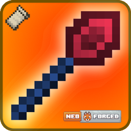

# REConstructed Wands

**REConstructed Wands** is a modernization and reconstruction of the classic building wands concept for **Minecraft** supporting both **NeoForge** and **Fabric** (1.21+).



## Features

- **Building Wands**: Place multiple blocks at once extending from existing blocks.
- **Destruction Wands**: Quickly remove blocks (with undo functionality).
- **Core Upgrades**: Upgrade your wands with different cores for enhanced capabilities.
- **Undo/Redo**: Mistakes happen! Use the undo feature to revert accidental placements.
- **Cross-Platform**: Built for both Fabric and NeoForge using a common codebase.
- **Configurable**: extensive configuration options to balance gameplay.

## Getting Started

### Installation
1. Download the latest release for your mod loader (Fabric/NeoForge).
2. Drop the jar into your `mods` folder.
3. Enjoy easier building!

### Basic Usage
- **Right-Click**: Place blocks.
- **Shift + Right-Click**: Open Wand GUI / Change Settings.
- **Mode Switching**: Toggle between Construction and Destruction modes.

## Development

This project uses Gradle with a multi-loader architecture.

### Building
```bash
./gradlew build
```

The output jars will be located in:
- `fabric/build/libs/`
- `neoforge/build/libs/`

## License

This project is licensed under the MIT License - see the [LICENSE](LICENSE) file for details.
